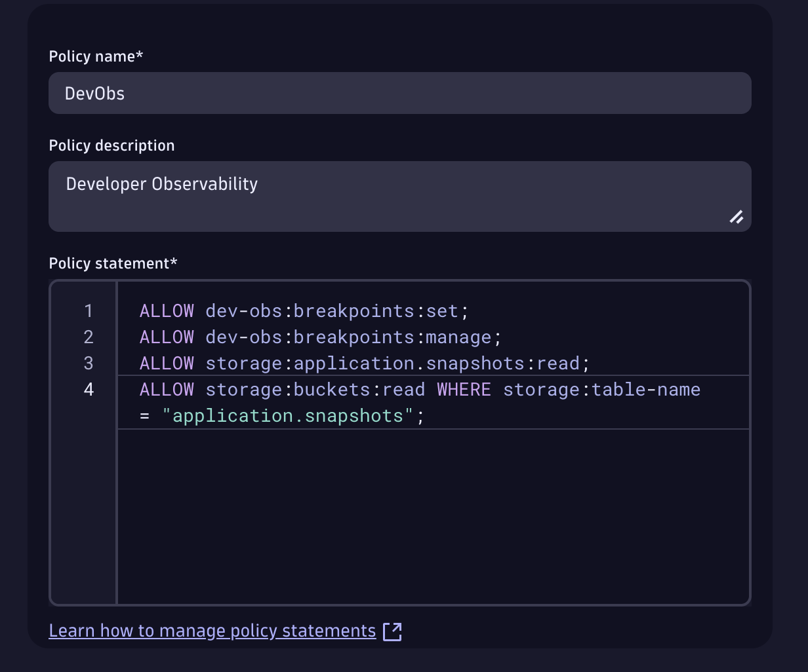
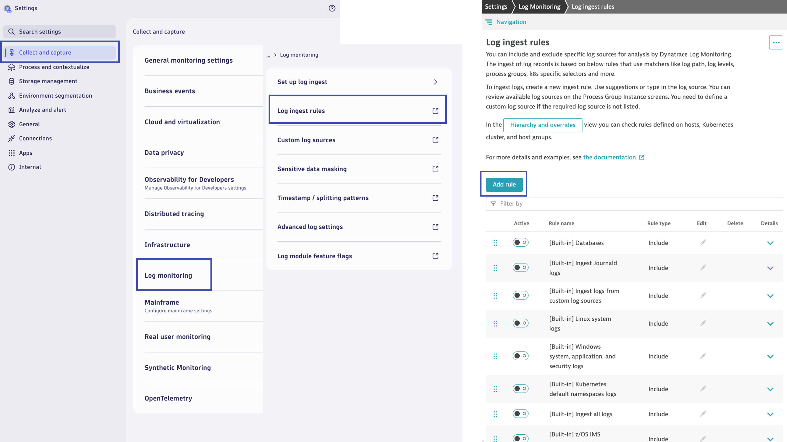
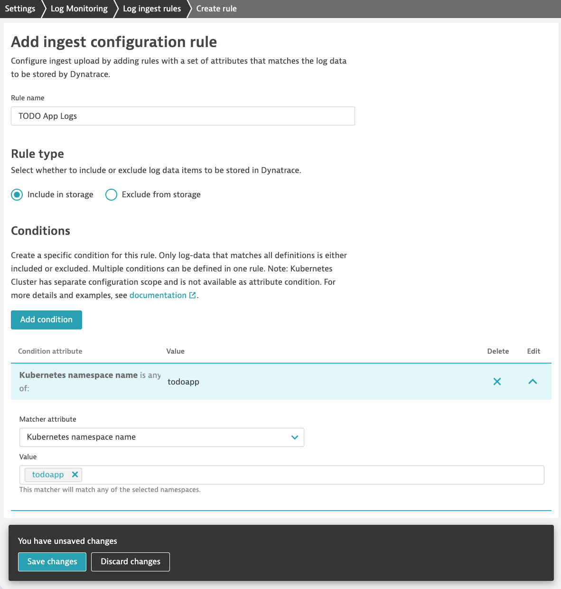

--8<-- "snippets/getting-started.js"
--8<-- "snippets/grail-requirements.md"

## 1. Dynatrace Tenant Setup
You will need a Dynatrace SaaS tenant with a DPS pricing model and the 'Code Monitoring' rate card should be associated with it. To validate go to Account Management > Subscription > Overview in your tenant. Code monitoring should be listed in the capability table.

In addition the application needs to be monitored with Dynatrace FullStack mode. This is done for you in this example.

The Live Debugger currently supports application runtimes: Java, NodeJS.

### 1.1 Enable Observability for Developers

- Go to Settings Classic > Preferences > OneAgent features.
     - Enable the Java Live-Debugger and Node.js Live-Debugger
- Go to Settings > Observability for Developers > Enable Observability for Developers

[More information can be found here](https://docs.dynatrace.com/docs/observe/applications-and-microservices/developer-observability/do-enable)


### 1.2 Set IAM Policies 
We take security very seriously. So let's create a policy to set user-level Live Debugging breakpoints. 

We need two policies for your user to be able to set breakpoints and to read snapshots. 
For this we go to **Account Management > Identity & Access management > Policy Management > Create Policy **

Set breakpoints
```bash
ALLOW dev-obs:breakpoints:set;
```
Read Snapshopts
```bash
ALLOW storage:application.snapshots:read;
ALLOW storage:buckets:read WHERE storage:table-name = "application.snapshots";
```

For managing snapshots, setting for Admins.
```bash
ALLOW dev-obs:breakpoints:manage;
```

The policy should look something like this:



[More info here about the IAM Policies here](https://docs.dynatrace.com/docs/observe/applications-and-microservices/developer-observability/offering-capabilities/setup)

Then we bind it to a user group. Next we'll create a Group and then add your user to the group.

Go to **Identify & Access Management > Group Management > Create Group**

Give the group a name and click **Create**.

In the Live Debugger group we just created click **+ Permission** and add the Policy we just created.


Finally ensure your user is part of the Live Debugger User group. Go to **Identity & Access Management > User Management** and find your user. Click on the three dots to the right and select **Edit User**. Ensure the group for 'Live Debugger User' is selected and Save.

For more granular access and contiued explanations [please continue reading here](https://docs.dynatrace.com/docs/observe/applications-and-microservices/developer-observability/offering-capabilities/setup) 


### 1.3 Enable Log Ingest

You have (2) options:

- Configure log ingest rule to ingest relevant logs for this lab
- Enable built-in log ingest rule to ingest all logs discovered by Dynatrace (**Be careful with this in practice**)

In your Dynatrace tenant, open the `Settings` App.  Navigate in the menus to `Collect and capture` > `Log monitoring` > `Log ingest rules`.  This will open the `Settings Classic` App and show you the **Log ingest rules**



**Ingest relevant logs**



Click on `Add rule` to create a new Rule.  Configure the Rule:

Rule name:
```text
TODO App Logs
```

Rule type:
```text
Include in storage
```

Conditions:
```text
Kubernetes namespace name = todoapp
```

Click on `Save changes`. 

Repeat the above steps for the Bugzapper app instead using namespace name = bugzapper.

**Ingest all logs**

Locate the rule `[Built-in] Ingest all logs` and enable it.  Click `Save changes`.

## 2. Create Dynatrace API Tokens for Kubernetes Observability
As described in the main README of this codespaces, you'll need two tokens:

1. Operator Token
2. Ingest Token 

We will get these two from the Kubernetes App. 

### 2.1. Get the Operator Token and the Ingest Token from the Kubernetes App

1. Open the Kubernetes App (CTRL + K then type Kubernetes for fast access)
2. Select the `+ Add cluster` button in the top right
3. Scroll down to the section Install Dynatrace Operator 
4. Click on generate Token for the 'Dynatrace Operator' and save it to your Notepad
5. Click on generate Token for the 'Data Ingest Token' and save it to your Notepad


## 3. Create OAuth Client for Automated Dynatrace Quiz App Deployment
In order to deploy the Dynatrace app into your tenant when the codespace starts up we will need to create an OAuth Client.

1. Go tou your Account Settings and select your desired account.
2. Navigate to Identity & access management > OAuth clients.
3. Click the Create client button.
4. Fill in your email and add the following scopes: `app-engine:apps:install` `app-engine:apps:run` `app-engine:apps:delete`
5. After selecting the appropriate OAuth permissions, click the Create client button at the bottom of the page to generate the OAuth client.
6. Save the Client ID and Client Secret which will be needed when starting the codespace.

More details can be found by following the [instructions here](https://developer.dynatrace.com/develop/deploy-your-app/#deploy-from-a-cicd-pipeline).

The Dynatrace quiz app will be deployed at: https://yourTenantID.apps.dynatrace.com/ui/apps/my.bug.busters/

!!! tip "Let's launch the Codespace"
    Now we are ready to launch the Codespace! You'll need your tenant and the tokens previuosly created from above. When you enter the tenant please enter it without the 'apps' part of the URL. For production tenants -> https://abc12345.live.dynatrace.com and for sprint tenants -> https://abc12345.sprint.dynatracelabs.com.


<div class="grid cards" markdown>
- [Let's launch Codespaces:octicons-arrow-right-24:](codespaces.md)
</div>